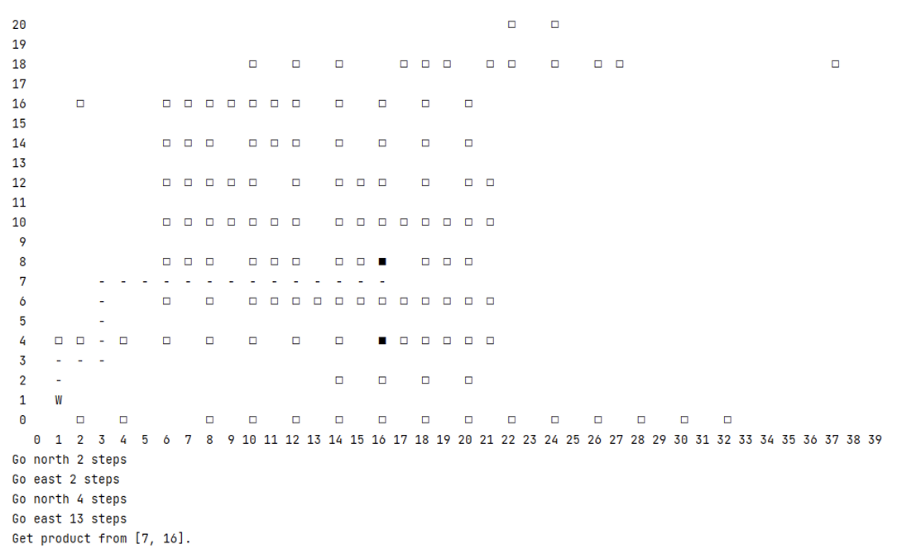

# Warehouse-Navigation-Application
The Warehouse Navigation Application aims to streamline the process of picking goods from shelves in a warehouse by employing efficient pathfinding algorithms. This application targets both human workers and robots, ensuring that orders are fulfilled swiftly and accurately while minimizing travel time.

## Features
- ### Multiple access points enable
  In real-world scenarios, goods on shelves may be obstructed by neighboring shelves, allowing access only from adjacent aisles. Our application accommodates this constraint, enabling users to find the shortest path considering access points.
  <img src="image/MAP.png" width=60%)
  
- ### Optimized results
  Recognizing the complexity of the Traveling Salesman Problem (TSP), particularly in large warehouses with extensive order lists, our application employs three distinct algorithms (Branch and   Bound, Held–Karp, and Nearest Neighbor) simultaneously. This approach yields optimized results within predefined time constraints.
  ![Algos]
  
- ### Specific Navigation
   Designed for ease of use, our application not only generates warehouse maps based on user input but also provides detailed routes with maps and instructions. This intuitive interface enhances   user experience and facilitates efficient navigation within the warehouse.
  
  
## Getting Started

## Dependencies

